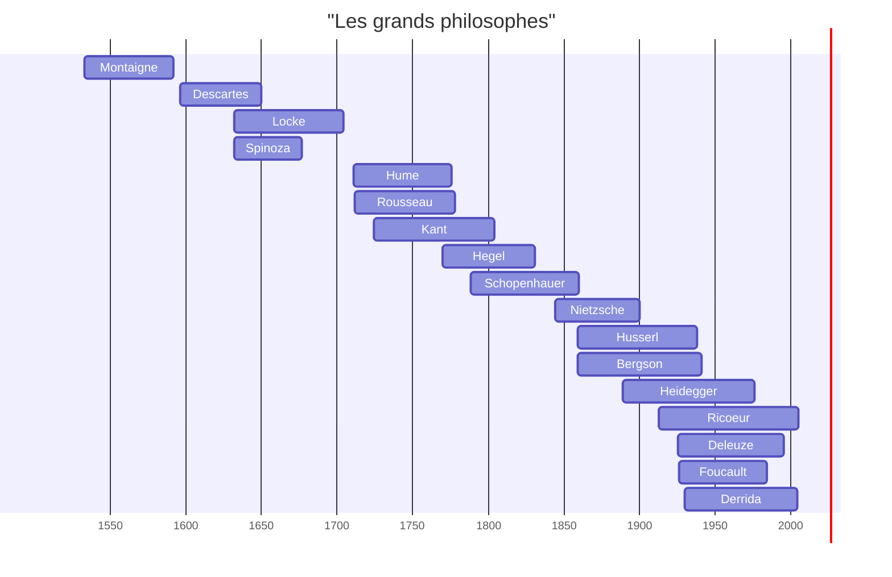
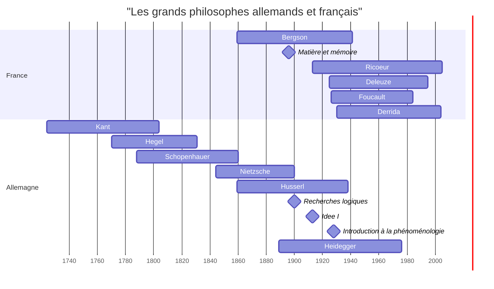

```mermaid
gantt
title "Les grands philosophes"
dateFormat YYYY
axisFormat %Y

Montaigne : 1533, 1592
Descartes : 1596, 1650
Locke : 1632, 1704
Spinoza : 1632, 1677
Hume : 1711, 1776
Rousseau : 1712, 1778
Kant : 1724, 1804
Hegel : 1770, 1831
Schopenhauer : 1788, 1860
Nietzsche : 1844, 1900
Husserl : 1859, 1938
Bergson : 1859, 1941
Heidegger : 1889, 1976
Ricoeur : 1913, 2005
Deleuze : 1925, 1995
Foucault : 1926,1984
Derrida : 1930,2004
```

# les sections

```mermaid
gantt
title "Les grands philosophes allemands et français"
dateFormat YYYY
axisFormat %Y

section France
Bergson : 1859, 1941
Matière et mémoire : milestone, m1, 1896, 0d
Ricoeur : 1913, 2005
Deleuze : 1925, 1995
Foucault : 1926,1984
Derrida : 1930,2004
section Allemagne
Kant : 1724, 1804
Hegel : 1770, 1831
Schopenhauer : 1788, 1860
Nietzsche : 1844, 1900
Husserl : 1859, 1938
Recherches logiques : milestone, m1, 1900, 0d
Idee I : milestone, m1, 1913, 0d
Introduction à la phénoménologie : milestone, m1, 1928, 0d

Heidegger : 1889, 1976
```