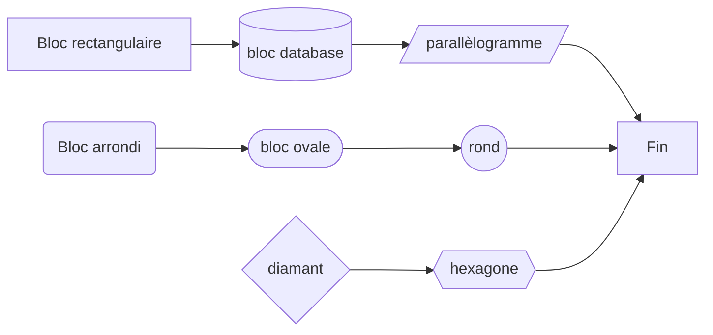
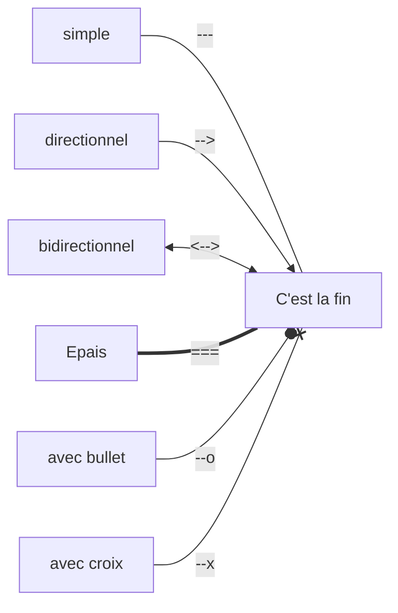
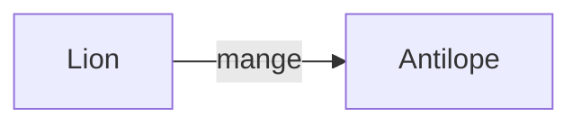
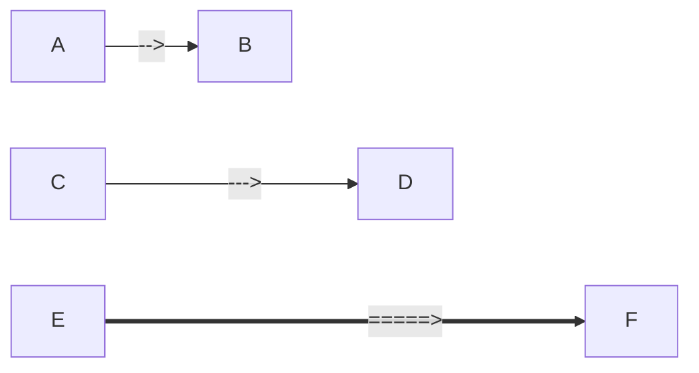
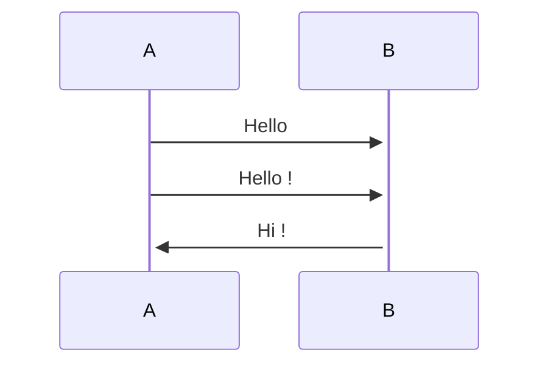
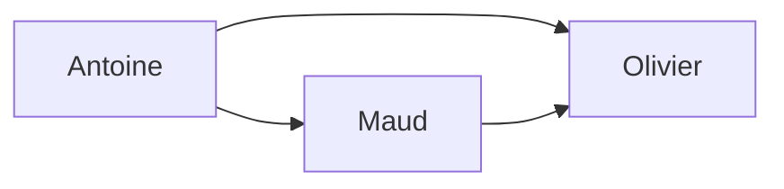

>[!warning]
>- La syntaxe Mermaid est sensible à la casse
>- Obsidian ne support pas les extensions interactives (`click href`)
## entête
On commence le bloc par triple quote `mermaid`
sur la seconde ligne, on indique `graph LR` ou `graph TD`

## Les éléments de base
### La forme des noeuds
Le libellé des noeuds peut être précisé entre crochets ou parenthèses :
- `A[Bloc rectangulaire]` avec crochets
	- `A[Bloc parallèlogrames]` avec crochets/slash
	- `C[(bloc database)]` avec crochet/parenthèse
- `B(Bloc arrondi)` avec parenthèses
	- `D([bloc ovale])` avec parenthèse/crochet
	- `E((bloc rond))` avec double parenthèses
- `F{bloc diamant}` avec des accolades
	- `G{{bloc hexagone}}` avec des double accolades

### types de liens

### liens nommés
En mettant `-- NOM` devant le lien (ex `-- mange -->`)

### Longueur des liens
Le nombre de tirets permet d'influer sur la longueur des liens

## sequenceDiagram

## graph

