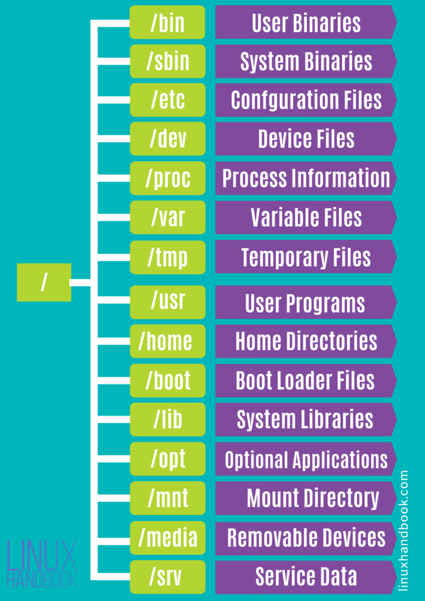

## le file system

## Points de montage

### Gestion des disques
`sudo fdisk -l`

`ls /dev/disk/by-uuid|by-id|`

### gestion des points de montage

`cat /etc/fstab` - affiche la configuration de montage
`cat /etc/mtab` - liste les points de montage actifs

### affichage des points de montage
- `mount` - affiche les points de montage
- `findmnt`
  - `-t <type>` filtre sur le type du point de montage.  
    Ex : **nfs**, **ext2**, **tmpfs**
  - `-i` inverse le filtrage (exclusion au lieu d'inclusion)
  - `-D` format similaire à df 
  - `-J` format JSON

### création de points de montage [`mount`](http://manpages.ubuntu.com/manpages/xenial/man8/mount.8.html)
- les options
  - `async` ou `sync`
  - time related 
    - `relatime` default
    - `atime` access times are updated if kernel 
    - `noatime` no access times
    - `strictatime`
    - `lazytime`, `nolazytime`
  - permissions
    - `suid`, `nosuid`
    - `rw` ou `ro`

### volumes

#### [`df`](https://linux.die.net/man/1/df) : report file system disk space usage

`df -h -T` - affiche l'espage libre des différents mount points

- `-t <fs>` - seulement les partitions de type **fs**
- `-x <fs>` - exclut les partitions de type **fs**
- `-l`, `--local` - seulement les partitions locales

### links

- `ln target_file link_name` - crée un hardlink vers **target_file**
- `ln -s target_file link_name` - crée un softlink vers **target_file**

### directory structure

[Filesystem Hierarchy Standard](http://www.pathname.com/fhs/pub/fhs-2.3.html) explique le rôle
des différents dossiers de l'arborescence linux (/var, /usr, /usr/local...)

### Articles

- [How to Create Symbolic Links in Linux [Complete Guide]](https://linuxhandbook.com/symbolic-link-linux/)
- [Hard Link in Linux: Everything Important You Need to Know](https://linuxhandbook.com/hard-link/?utm_source=newsletter&utm_medium=email&utm_campaign=linux_directory_structure_free_df_and_sort_commands_example_hard_and_soft_links_and_more&utm_term=2019-07-28)
